# thinkpad-linux-audio

Dolby DAX3 speaker tuning for Lenovo ThinkPad laptops, extracted from Lenovo's official Windows audio driver and converted to [EasyEffects](https://github.com/wwmm/easyeffects) presets for use on any Linux distribution. Pre-generated assets are provided for the ThinkPad Z16 Gen 1; the pipeline works for all models covered by the same driver package.

---

## The problem in one paragraph

Lenovo's acoustic engineers, working with Dolby, design custom digital signal processing (DSP) filters for each ThinkPad model. These filters compensate for the physical limitations of the laptop's speaker enclosure — correcting the frequency response, applying compression and limiting to protect the drivers, and adding speaker virtualization for certain listening modes. On Windows, this DSP chain runs transparently inside the Realtek audio driver as *Dolby DAX3*. On Linux, PipeWire and ALSA route audio directly to the hardware. The speakers function correctly, but without the acoustic compensation they were designed to need. The result is audio that is measurably and audibly different from what Lenovo intended for the hardware.

This repository provides pre-converted EasyEffects presets for the Z16 Gen 1 so that Linux users get the same speaker tuning that ships with the machine.

---

## Quick start — ThinkPad Z16 Gen 1

**Prerequisites:** PipeWire (standard on most distributions since 2022), EasyEffects 7.x or later.

See [docs/usage.md](docs/usage.md) for full installation instructions across distributions. The short version:

```bash
# 1. Install EasyEffects (Flatpak, works on any distro)
flatpak install flathub com.github.wwmm.easyeffects

# 2. Create the EasyEffects data directories
mkdir -p ~/.local/share/easyeffects/irs
mkdir -p ~/.local/share/easyeffects/output

# 3. Copy the shared IRS files (required by both preset sets)
cp assets/thinkpad-z16-gen1/irs/*.irs ~/.local/share/easyeffects/irs/

# 4. Copy your preferred preset set (see below)
cp assets/thinkpad-z16-gen1/presets/enhanced/*.json ~/.local/share/easyeffects/output/

# 5. Launch EasyEffects, open the Output presets panel, and load:
#    Z16-Music-Balanced   (recommended starting point)
```

---

## Preset sets

Two preset sets are provided for the Z16 Gen 1. Both use the same IRS impulse response files (Lenovo's speaker correction).

### Enhanced (`presets/enhanced/`) — recommended

Derived from the Dolby DAX3 data but with the signal-dependent compression chain removed and replaced with stages that work correctly without the Windows DAX3 APO. The result is Lenovo's acoustic correction with better perceived clarity, louder output, and no compression artefacts.

| Change from Dolby originals | Reason |
|---|---|
| Multiband compressor removed | Requires the Windows DAX3 APO's content classifier to operate correctly; causes audible compression artefacts on Linux |
| Exciter added (5.5 kHz+, 8th-order harmonics) | Restores perceived clarity and air in the frequency range above the IEQ correction bands |
| Autogain enabled at −14 LUFS | Bypassed in Dolby originals due to classifier dependency; re-enabled with a conservative target |
| Voice profiles gain an autogain stage | Absent from the Dolby Voice pipeline; useful for call and speech normalisation |
| Limiter gain-boost enabled + 4× oversampling | Brings output level in line with expectations; cleaner peak interception |

### Dolby originals (`presets/dolby/`) — reference

A faithful translation of Lenovo's DAX3 tuning data. Useful as a reference or if you want to experiment with re-enabling the compression stages. On Linux, without the Windows DAX3 APO, these presets will sound noticeably compressed and quieter than intended.

---

## Available presets

### Enhanced set (`Z16-*`)

| Preset | Dolby profile | Tone | Pipeline |
|---|---|---|---|
| `Z16-Music-Balanced` | Music | Balanced | convolver → exciter → autogain → limiter |
| `Z16-Music-Detailed` | Music | Detailed | ↑ |
| `Z16-Music-Warm` | Music | Warm | ↑ |
| `Z16-Dynamic-Balanced` | Dynamic | Balanced | convolver → stereo_tools → eq → exciter → autogain → limiter |
| `Z16-Dynamic-Detailed` | Dynamic | Detailed | ↑ |
| `Z16-Dynamic-Warm` | Dynamic | Warm | ↑ |
| `Z16-Movie-Balanced` | Movie | Balanced | convolver → stereo_tools → eq → exciter → autogain → limiter |
| `Z16-Movie-Detailed` | Movie | Detailed | ↑ |
| `Z16-Movie-Warm` | Movie | Warm | ↑ |
| `Z16-Game-Balanced` | Game | Balanced | convolver → exciter → autogain → limiter |
| `Z16-Game-Detailed` | Game | Detailed | ↑ |
| `Z16-Game-Warm` | Game | Warm | ↑ |
| `Z16-Voice-Balanced` | Voice | Balanced | convolver → eq → exciter → autogain → limiter |
| `Z16-Voice-Detailed` | Voice | Detailed | ↑ |
| `Z16-Voice-Warm` | Voice | Warm | ↑ |
| `Z16-Voice_Onlinecourse-Balanced` | Voice (lecture) | Balanced | ↑ |
| `Z16-Voice_Onlinecourse-Detailed` | Voice (lecture) | Detailed | ↑ |
| `Z16-Voice_Onlinecourse-Warm` | Voice (lecture) | Warm | ↑ |

**Start with `Z16-Music-Balanced`.** For video content use `Z16-Dynamic-Balanced` (adds stereo widening). For calls and speech use `Z16-Voice-Balanced`.

### Tone variants

All profiles come in three IEQ (Intelligent EQ) tonal variants derived from Lenovo's DAX3 tuning data:

- **Balanced** — neutral reference, closest to Lenovo's measured acoustic target
- **Detailed** — presence-range emphasis; useful if the speakers sound dull
- **Warm** — reduced brightness; useful if you find the default response fatiguing

---

## Stage reference

| Stage | Present in | What it does |
|---|---|---|
| **Convolver** | All | Minimum-phase FIR encoding Lenovo's IEQ correction + per-channel audio-optimizer gains |
| **Stereo Tools** | Dynamic, Movie | Surround widening from Dolby's virtualizer coefficients |
| **Equalizer** | Dynamic, Movie, Voice | 100 Hz 4th-order high-pass (speaker protection) + profile-specific PEQ |
| **Exciter** | All (enhanced only) | Synthetic harmonics above 5.5 kHz; restores perceived clarity |
| **Autogain** | All (enhanced); Music/Dynamic/Movie/Game (Dolby) | EBU R128 loudness normalisation |
| **Multiband Compressor** | Dolby originals only | Classifier-dependent dynamics; removed from enhanced set |
| **Limiter** | All | Brickwall at −1 dBFS; gain-boost enabled in enhanced set |

The diagram below shows all three signal paths side by side, with frequency-response sketches and notes on the two stages added in the enhanced set. See [docs/background.md](docs/background.md) for the full technical explanation.



---

## Other ThinkPad models

The Lenovo audio driver package that contains the Z16 tuning data also covers a large number of other ThinkPad models. This repository ships pre-generated assets for the Z16 Gen 1 only because that is the hardware on which the output has been directly verified. However, the full generation pipeline is documented and scripted for any model covered by the same driver package.

If you have a different ThinkPad model: see [docs/reproduce.md](docs/reproduce.md) and [scripts/generate-presets.sh](scripts/generate-presets.sh).

---

## Documentation

| Document | Contents |
|---|---|
| [docs/background.md](docs/background.md) | Why laptop audio needs DSP, what DAX3 is, how the conversion works |
| [docs/usage.md](docs/usage.md) | Installing EasyEffects and applying presets on any Linux distribution |
| [docs/reproduce.md](docs/reproduce.md) | Regenerating assets from the Lenovo driver package for any supported model |
| [HARDWARE.md](HARDWARE.md) | Supported hardware, subsystem IDs, how to identify your model |

---

## Asset provenance

The `.irs` and `.json` files in `assets/` are computed from `DEV_0287_SUBSYS_17AA22F2_PCI_SUBSYS_22F217AA.xml`, which is Lenovo's official Dolby DAX3 tuning file for the ThinkPad Z16 Gen 1. This XML is distributed by Lenovo inside the signed Windows audio driver package `n3ga127w.exe`, available from Lenovo's support site. It is included here for transparency and reproducibility verification.

The Dolby-original presets were generated with [antoinecellerier/speaker-tuning-to-easyeffects](https://github.com/antoinecellerier/speaker-tuning-to-easyeffects). The enhanced presets were derived from those via `scripts/generate-enhanced-presets.py`. The scripts and documentation in this repository are MIT-licensed. The derived audio assets carry Lenovo's original distribution terms; they are provided here under the same basis as binary firmware files distributed by the linux-firmware project — sourced from the vendor, redistributed for hardware compatibility.
